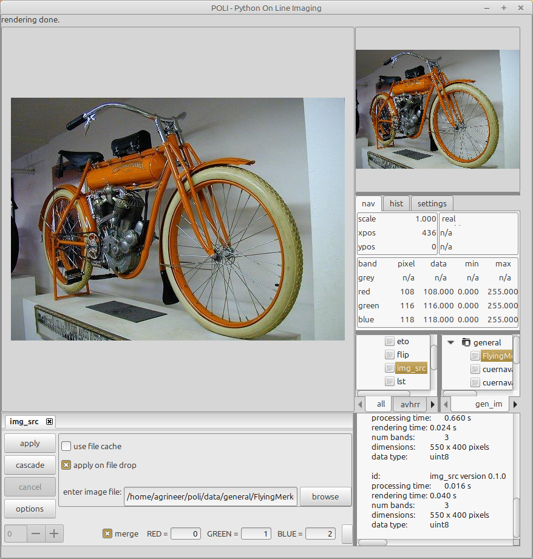
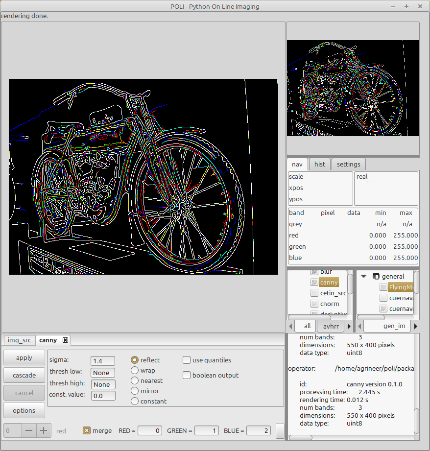
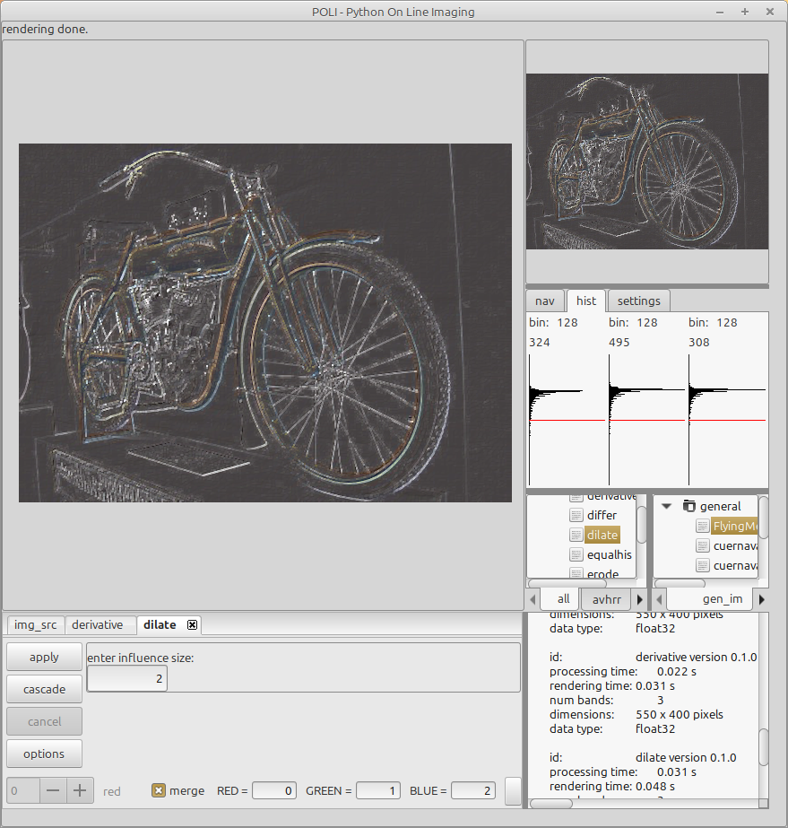
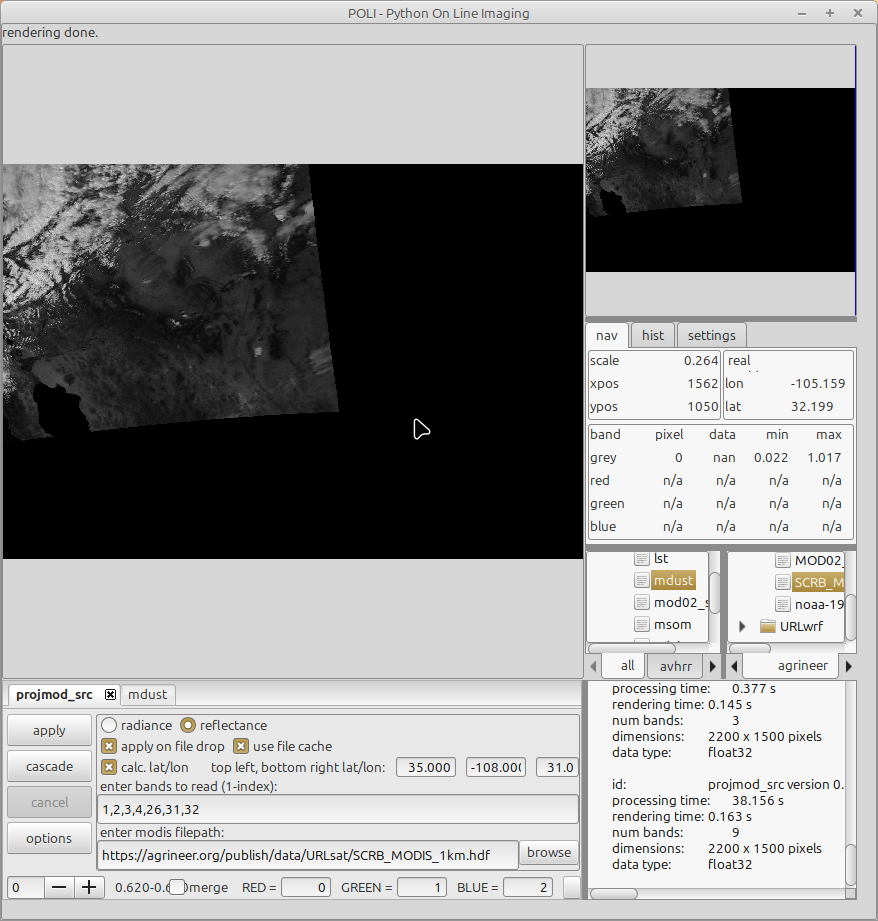
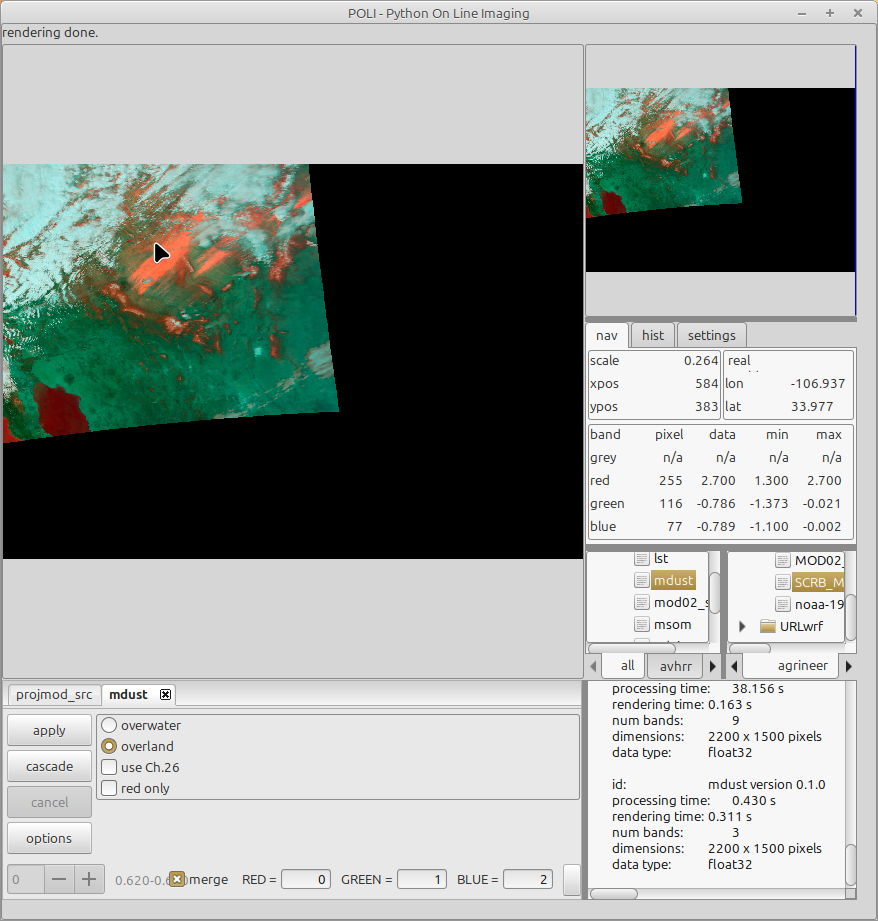
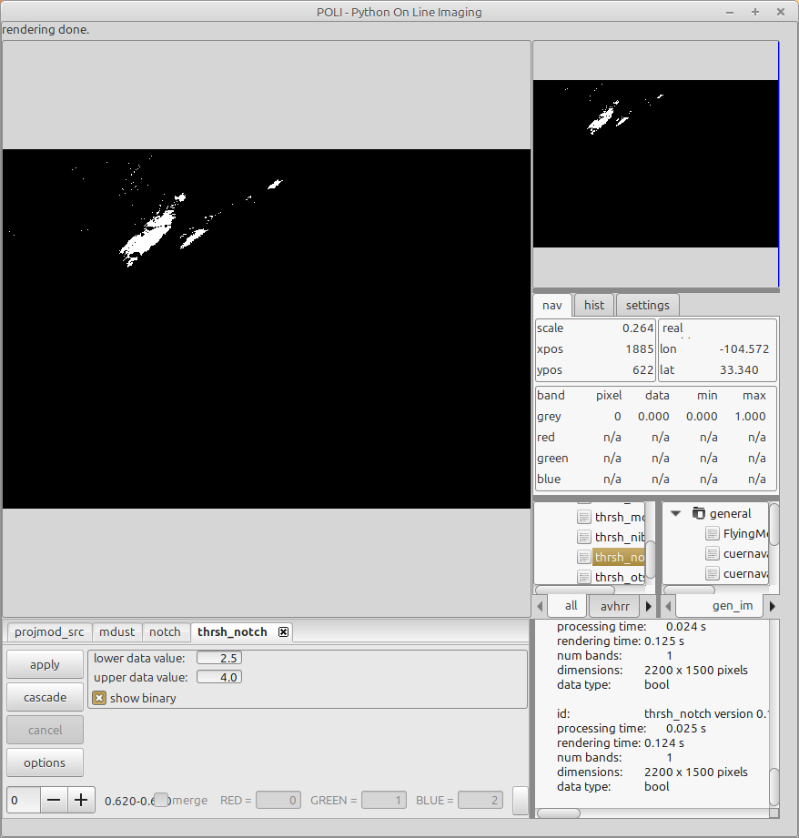

# Python On Line Imaging (POLI)
 
## Introduction
POLI is an educational and research oriented datacube processing package using the Python Numpy library. It is intended to give students an introduction to data streaming for usage and programming. POLI is also a tool for research projects due its flexibility in code development, from prototyping with a visual display to implementation in batch or command line piping mode intended for HPC or other non-graphic platforms.

POLI is stream oriented, so that the output of one operator (data filter) is used as input for the next operator. In the manner of UNIX and GNU/Linux platforms, data streaming allows for the development of small, yet robust, modular components for an overall application. Operators can be developed independent of the visual frame and are dynamically loaded for implementation.

POLI can be used with a graphical interface, or in Python batch mode, or in a command terminal using piping.

#### GUI Implementation
The image below shows the graphical version with just an input operator, invoked by double clicking on the high lighted "img_src" tree leaf. An image can be specified by either a previously defined image/data tree leaf or by manually specifying or by drag and drop.

The image below shows the Canny edge detection operator applied to each of the buffers in the source datacube, in this case just RGB buffers.

Another example of streaming is given below with several operators applied.

POLI has been used in projects involving weather simulations, water evaporation climate classification,  satellite direct reading processing among other research projects.

The image below shows a projected MODIS image over the south western US and northern Mexico.

Scientific data can be difficult to process in the event of missing values in the input datacube. It is common to designate these non-values as "Not a Number" (NaN). POLI uses the array processing Numpy library, which is NaN aware and by extension so are POLI operators if the programmer
takes it into account.

In the satellite image above the NaN values are depicted as black and hovering the mouse over those pixels will show a 
value of NaN in the "nav" panel. 

The image below is the result of a dust detection operator applied to the above datacube. The dust is shown in orange. 

 

The next image is the result of basic thresholding to get a mask for the dust.

### Command Line and Batch Implementation

Command line and batch execution is important when processing on non-graphic platforms, eg. High Performace Computer clusters . Many examples are given in the $POLI_HOME/misc/commands.bash script, but here are just two examples:

\$ img_src -f $POLI_HOME/data/general/FlyingMerkel.jpeg | canny | render -f CANNY_FM.jpg -c 0,1,2

\$ cetin_src | msom | render -f CETIN_MSOM.jpg

Here, the operator "render" takes the output and makes an image. 

An example batch script is also given in $POLI/misc/cetin_batch.py where several  operators are used in a streamed (concatenated) way.

It is important to note that operators use the same processing routines whether implemented graphically, command line, or in batch mode. 

## Installation

You can "git clone" the package or if you have a tar file untar it with "tar xvf poli.tar"

You must have a POLI_HOME environment variable pointing to the location of the POLI package, for example:

\$ export POLI_HOME=/home/user/poli

This environment variable should be in the user's profile or rc shell files so that it becomes automatic when invoking a shell. You should also include a POLI_URL variable for URL operators and data, if desired. Next, be sure to include $POLI_HOME/bin in your $PATH variable. For example:

\$ export PATH=$POLI_HOME/bin:$PATH

Likewise, the PYTHONPATH variable should be set to:

export PYTHONPATH=$POLI_HOME/frame:$POLI_HOME/operators:$PYTHONPATH

These variables must be set before running the POLI examples given in $POLI_HOME/misc/commands.bash,
$POLI_HOME/misc/cetin_batch.py, or for the GUI POLI.

An example shell profile is given in $POLI_HOME/misc/bash_profile.

You can run POLI in a system wide environment but it a good practice to create a Python environment directory, for example:

\$ python3 -m venv .poli
 
Activate the environment:

\$ cd .poli

\$ source bin/activate

You should see the terminal prompt prefixed with (.poli)

Get the Python requirements:

\$ pip3 install -r $POLI_HOME/misc/NO_GUI_requirements.txt

In this case we set the environment to run without graphics. To run with graphics use:

\$ pip3 install -r $POLI_HOME/misc/GUI_requirements.txt

Running command line or batch works with the GUI modules installed.

To run the default GUI version:

(.poli) \$ poli

### Customizing POLI

Poli can be customized through input configuration  ".ini" files.

For example:

(.poli) \$ poli -c /home/user/mypoli.ini

The input ".ini" files configure which POLI operators and example data to use. An example file is given in $POLI_HOME/projects/default.ini. A more extensive explanation is given in the POLI documentation.

